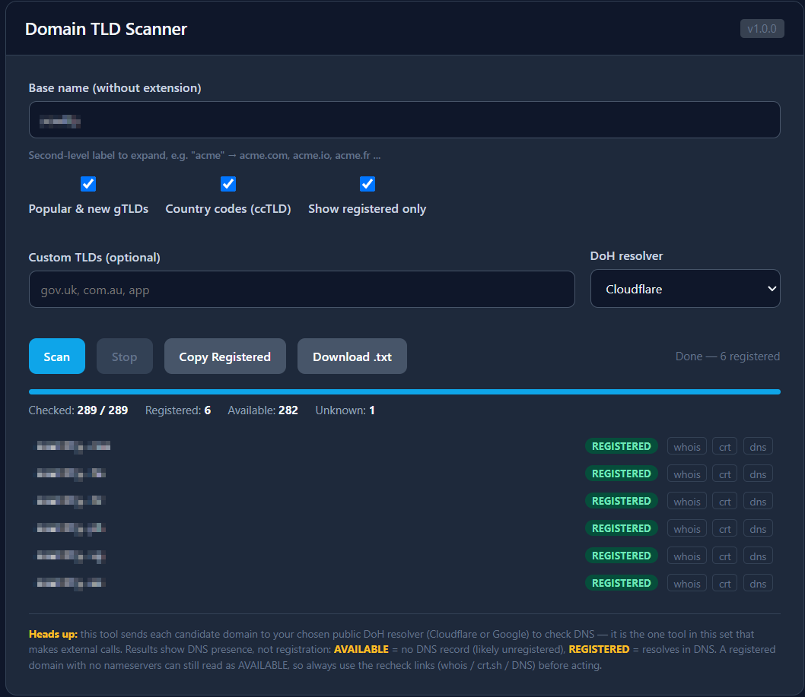

# Domain TLD Scanner

Expand a base name across hundreds of TLDs and resolve each one through a public DNS-over-HTTPS (DoH) resolver to see **which domains are registered** — each result comes with whois / crt.sh / DNS recheck links so you can confirm before acting.

> ⚠️ **This tool makes external calls.** Unlike every other bookmarklet in this collection, the Domain TLD Scanner sends each candidate domain name to your chosen public DoH resolver (Cloudflare or Google) to check DNS. That is how it works — there is no way to resolve a domain without contacting a resolver. Nothing else leaves your browser, and the source is readable so you can verify exactly what is sent and where.

## What it does

Enter a base name (e.g. `acme`), pick which TLD sets to use, and the scanner builds `acme.com`, `acme.io`, `acme.fr`, … across ~300 TLDs, then resolves each in parallel and labels it:

- **REGISTERED** — the name resolves in DNS (`NOERROR`)
- **AVAILABLE** — no DNS record (`NXDOMAIN`), likely unregistered
- **UNKNOWN** — the resolver gave an inconclusive answer or errored

> DNS presence is not the same as registration. A registered domain parked without nameservers can read as AVAILABLE, and some registries behave unusually. Always use the per-row **whois / crt.sh / dns** recheck links before you rely on a result.

## Features

- **~300 TLDs out of the box** — the full ccTLD set plus popular and new gTLDs, all embedded (no IANA fetch)
- **Custom TLDs** — add anything missing (`gov.uk`, `com.au`, …), merged with the built-in sets
- **Two resolvers** — choose Cloudflare or Google DoH
- **Live status** — REGISTERED / AVAILABLE / UNKNOWN badges with a progress bar and running counts
- **Recheck links** — every domain links out to whois, crt.sh, and a DNS lookup
- **Concurrent + stoppable** — scans in parallel (16 at a time) with a Stop button
- **Export** — Copy Registered to clipboard, or Download a full `.txt` report
- **"Show registered only"** — hide the noise and keep just the hits
- **CSP-safe** — runs inside its own popup window, so it works even on pages with a strict Content-Security-Policy; results are built with DOM methods, not `innerHTML`

## Installation

**Option 1 — Interactive installer:** open the [installer page](../install.html) and drag the **Domain TLD Scanner** button to your bookmarks bar.

**Option 2 — Manual:** open `domain-tld-scanner.js`, copy the single-line `BOOKMARKLET CODE` from the comment at the bottom, create a new bookmark, and paste it as the URL.

## Usage

1. Click the bookmarklet on any page (it pre-fills the base name from the current site).
2. Adjust the base name and TLD sets, pick a resolver, and click **Scan**.
3. Watch results stream in. Use the recheck links to confirm anything interesting.
4. **Copy Registered** or **Download .txt** to feed the results into your workflow.

> Tip: for large or authoritative sweeps, copy the registered list into a dedicated resolver such as `dnsx`, `dig`, or `amass`.

## Notes

- 100% client-side apart from the DoH lookups described above — there is no server.
- Allow popups for the site if the window does not appear.
- The "Open All" behaviour is intentionally not included; open individual domains from the result rows instead.
