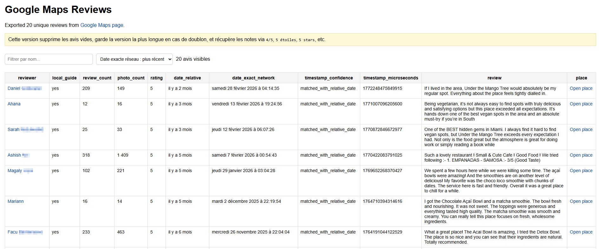

# Google Maps Review Extractor Bookmarklet

Extract reviews from a Google Maps place — reviewer, rating, relative date, and the **exact timestamp** recovered from Google's own network responses — then export a searchable, sortable HTML report. Built for OSINT, reputation analysis, and archiving reviews before they change.

## Screenshot

## Features

### Extraction
- **Auto-scroll**: scrolls the Reviews panel until your target count is reached (or the list runs out)
- **Expands truncated reviews**: clicks "more / lire la suite / voir plus" so full review text is captured
- **Per-review fields**: reviewer name, profile URL, Local Guide status, review count, photo count, rating, relative date, and full body text
- **Deduplication**: identical reviews are collapsed, keeping the longest version of the body

### Exact timestamps
- Passively wraps the page's own `fetch`/`XMLHttpRequest` to read the responses Google is already loading
- Recovers the microsecond timestamps embedded in those responses
- Matches each timestamp to a review using its relative date ("il y a 2 mois" / "2 months ago"), with a confidence field (`matched_with_relative_date` or `not_found`)
- Renders a human-readable exact date (default timezone `Europe/Paris`)

### Export
- Self-contained **HTML report** with a sortable table (by exact date or reviewer name) and a live name filter
- Reviewer names link to their Google Maps contributor profiles
- Filename includes the review count and export date

## Privacy

This bookmarklet makes **no external calls of its own**. It only reads responses the page is already fetching, and writes the result locally via a `Blob` download. Nothing is sent anywhere. The source is readable — verify it yourself.

## Installation

### Drag & Drop
Visit the [Interactive Installer](https://htmlpreview.github.io/?https://github.com/gl0bal01/bookmarklets/blob/main/install.html) and drag the Google Maps Review Extractor button to your bookmark bar.

### Manual
1. Copy the minified JavaScript from the bottom of `google-maps-review-extractor.js` (the `BOOKMARKLET CODE` line)
2. Create a new bookmark in your browser
3. Paste the code as the bookmark URL

## Usage

1. Open a place on Google Maps and click into its **Reviews** panel
2. Click the bookmarklet
3. Enter how many reviews to export (default 200)
4. Wait while it auto-scrolls — a status indicator in the bottom-right shows progress (`Loaded unique reviews: X / TARGET | timestamps seen: N`)
5. When it finishes, an HTML report downloads automatically

## Output Columns

| Column | Meaning |
|--------|---------|
| reviewer | Reviewer name (links to contributor profile when available) |
| local_guide | Whether the reviewer is a Local Guide |
| review_count / photo_count | Reviewer's totals, when shown |
| rating | Star rating, normalized (e.g. `4`, `5`) |
| date_relative | Relative date as displayed by Google |
| date_exact_network | Exact date recovered from network responses |
| timestamp_confidence | `matched_with_relative_date` or `not_found` |
| timestamp_microseconds | Raw microsecond timestamp |
| review | Full review text |
| place | Link back to the Google Maps page |

## Browser Compatibility

Works in modern browsers (Chrome, Firefox, Edge, Safari, Brave). The Reviews panel must be open and scrollable.

## Limitations

- Relies on Google Maps' current DOM class names and response shapes; may break when Google changes its page structure
- Exact timestamps are only available for reviews whose data passed through the network responses captured during the run; older reviews loaded before the bookmarklet ran may show `not_found`
- Timestamp matching is heuristic (relative-date proximity within a tolerance) and can occasionally mismatch
- Relative-date parsing covers French and English phrasing

## Contributing

Contributions welcome! Please see the main repository's [CONTRIBUTING.md](../CONTRIBUTING.md) for guidelines.
