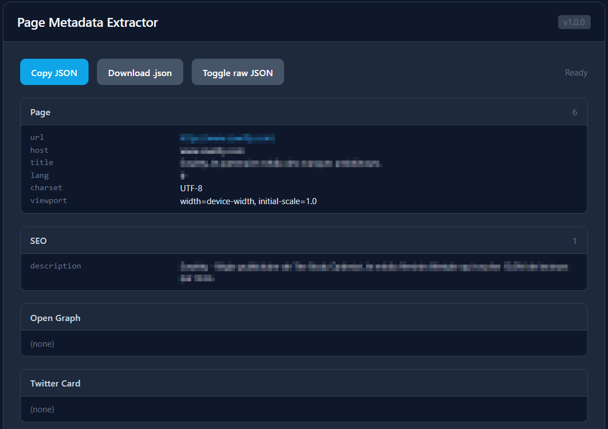

# Page Metadata Extractor

Dump everything a page declares about itself — SEO tags, social cards, structured data, and third-party dependencies — into a clean, readable report you can copy or download as JSON. Fully passive: it reads the DOM you already loaded and makes **no network calls**.

## What it extracts

- **Page** — URL, host, title, `<html lang>`, charset, viewport
- **SEO** — description, keywords, author, robots, generator, theme-color, canonical, favicon
- **Open Graph** — every `og:*` tag
- **Twitter Card** — every `twitter:*` tag
- **Dublin Core** — every `dc.*` tag
- **JSON-LD** — `application/ld+json` blocks, parsed (schema.org Organization, Person, BreadcrumbList, …)
- **Third-party script hosts** — external `<script src>` hostnames with counts (quick tech / tracker fingerprint)
- **Icons** — all icon/apple-touch link rels
- **Alternate / hreflang** — localized and alternate URLs
- **Resource hints** — preconnect / dns-prefetch / preload / prefetch targets
- **All meta tags** and **all link tags** — the raw lists, nothing dropped

## Features

- Grouped, scannable report with per-section counts; URLs are clickable
- **JSON-LD parsed**, not just shown as text — invalid blocks are flagged, not skipped
- **Copy JSON** and **Download .json** for the full structured payload
- **Toggle raw JSON** view
- 100% client-side, zero network calls
- **CSP-safe** — renders in its own popup window and builds the DOM with `createElement`/`textContent` (no `innerHTML` of page-controlled values), so untrusted meta content can't inject script

## Why it's useful for OSINT

Open Graph, Twitter Card, and JSON-LD are where sites volunteer the structured truth about themselves — real org names, authors, publish dates, social handles, image CDNs. The `generator` tag and third-party script hosts fingerprint the stack (CMS, analytics, tag managers) without sending a single request. It complements the Website Recon Scanner, which is active and same-origin; this one is instant and passive.

## Installation

**Option 1 — Interactive installer:** open the [installer page](../install.html) and drag the **Page Metadata Extractor** button to your bookmarks bar.

**Option 2 — Manual:** open `page-meta-extractor.js`, copy the single-line `BOOKMARKLET CODE` from the comment at the bottom, create a new bookmark, and paste it as the URL.

## Usage

1. Open any page (an article, product, or company site gives the richest data).
2. Click the bookmarklet — a report window opens immediately.
3. Read the grouped sections, click through URLs, or **Copy JSON** / **Download .json**.

## Notes

- Allow popups for the site if the window does not appear.
- Results reflect what the page declares in its DOM at click time — single-page apps may add more metadata after navigation.
