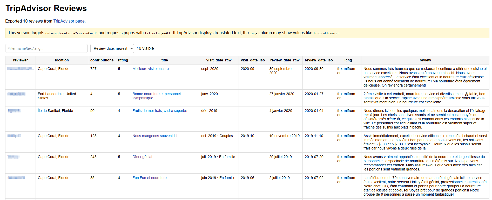

# TripAdvisor Review Extractor Bookmarklet

Extract reviews from a TripAdvisor listing — reviewer, location, contributions, rating, visit date, review date, language, and full text — across **all languages**, then export a searchable, sortable HTML report. Built for OSINT, reputation analysis, and archiving reviews before they change.

## Screenshot

## Features

### Extraction
- **Paginates automatically**: rewrites the review URL (`-Reviews-or10-`, `-or20-`, …) and fetches each page until your target count is reached or pages run dry
- **All languages**: forces `filterLang=ALL` so reviews in every language are returned, not just the current UI language
- **Per-review fields**: reviewer, profile URL, location, contributions count, rating, title, review URL, visit date, written/review date, language code, and full body
- **Date parsing**: French and English month names are normalized to ISO (`YYYY-MM-DD` for review dates, `YYYY-MM` for visit dates)
- **Rating recovery**: from the bubble-rating `<title>`, French/English phrasing, or the `bubble_NN` class
- **Deduplication**: by review URL when available, otherwise a normalized key; keeps the longest version of the body

### Export
- Self-contained **HTML report** with a sortable table (review date, rating, or reviewer name) and a live filter over name/text/language
- Reviewer names and review titles link back to TripAdvisor
- Filename includes the review count and export date

## Privacy

This bookmarklet is **same-origin only**. It fetches TripAdvisor's own review pages (the site you are already on) and writes the result locally via a `Blob` download. There are **no third-party calls**. The source is readable — verify it yourself.

## Installation

### Drag & Drop
Visit the [Interactive Installer](https://htmlpreview.github.io/?https://github.com/gl0bal01/bookmarklets/blob/main/install.html) and drag the TripAdvisor Review Extractor button to your bookmark bar.

### Manual
1. Copy the minified JavaScript from the bottom of `tripadvisor-review-extractor.js` (the `BOOKMARKLET CODE` line)
2. Create a new bookmark in your browser
3. Paste the code as the bookmark URL

## Usage

1. Open a TripAdvisor listing and go to its **Reviews** page (URL contains `-Reviews-`)
2. Click the bookmarklet
3. Enter how many reviews to export (default 200)
4. Wait while it paginates — a status indicator in the bottom-right shows progress (`TripAdvisor: loading offset N | reviews: X`)
5. When it finishes, an HTML report downloads automatically

## Output Columns

| Column | Meaning |
|--------|---------|
| reviewer | Reviewer name (links to TripAdvisor profile when available) |
| location | Reviewer's stated location |
| contributions | Reviewer's contribution count, when shown |
| rating | Star/bubble rating, normalized (e.g. `4`, `4.5`, `5`) |
| title | Review title (links to the review when available) |
| visit_date_raw / visit_date_iso | Date of visit as shown, and normalized `YYYY-MM` |
| review_date_raw / review_date_iso | Date the review was written, and normalized `YYYY-MM-DD` |
| lang | Language code (e.g. `en`, `fr`, or `fr-x-mtfrom-en` for machine-translated) |
| review | Full review text |

## Browser Compatibility

Works in modern browsers (Chrome, Firefox, Edge, Safari, Brave). Must be run from a TripAdvisor review page so the paginated fetches are same-origin.

## Limitations

- Relies on TripAdvisor's current URL scheme (`-Reviews-or<offset>-`) and DOM markers (`data-automation="reviewCard"`, `data-test-target`); may break when TripAdvisor changes its markup
- Fetches are same-origin and depend on your existing session/cookies; rate-limiting or anti-bot measures may interrupt long runs (stops after 3 empty pages)
- Date and rating parsing cover French and English phrasing
- Machine-translated reviews are captured with their `lang` marker so you can tell originals from translations

## Contributing

Contributions welcome! Please see the main repository's [CONTRIBUTING.md](../CONTRIBUTING.md) for guidelines.
