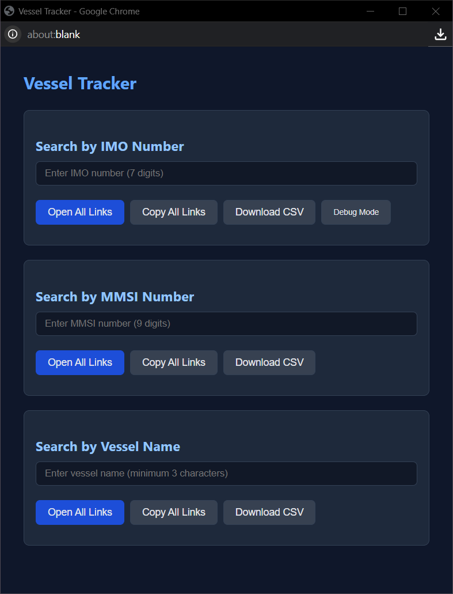

# 🚢 Vessel Tracker Links Bookmarklet

Generate tracking links for vessels across multiple maritime platforms using IMO numbers, MMSI numbers, or vessel names with built-in validation and export capabilities.

## Screenshot


## ✨ Features

### 🔍 Multiple Search Methods
- **IMO Number Search**: Validate and search using 7-digit IMO numbers with checksum verification
- **MMSI Number Search**: Validate and search using 9-digit MMSI numbers
- **Vessel Name Search**: Search by vessel name with minimum 3-character validation

### 🌐 Comprehensive Platform Coverage
- **MarineTraffic**: Real-time vessel positions and details
- **VesselFinder**: Vessel tracking and information database
- **MyShipTracking**: Ship tracking and maritime data
- **BalticShipping**: Maritime database and tracking
- **VesselTracker**: Ship positions and vessel data
- **ShipVault**: Vessel information repository


## 🚀 Installation

### Method 1: Manual Bookmark Creation
1. Copy the minified bookmarklet code from the bottom of [vessel-tracker.js](vessel-tracker.js)
2. Create a new bookmark in your browser
3. Paste the code as the bookmark URL
4. Save the bookmark with name "Vessel Tracker"

### Method 2: Drag & Drop Installation
1. Visit the [installation page](../install.html)
2. Drag the "Vessel Tracker" button to your bookmarks bar
3. The bookmarklet is now ready to use

## 📖 Usage

1. **Navigate** to any webpage (the bookmarklet works universally)
2. **Click** the Vessel Tracker bookmark
3. **Enter** vessel information in the popup window:
   - IMO number (7 digits) - automatically validated with checksum
   - MMSI number (9 digits) - format validated
   - Vessel name (minimum 3 characters)
4. **Choose** your action:
   - Click "Open All Links" to open all tracking sites
   - Click "Copy All Links" to copy URLs to clipboard
   - Click "Download CSV" to export data as spreadsheet

## 🛠️ Use Cases

### 🔍 Maritime OSINT Investigations
- Track vessel movements for investigation purposes
- Cross-reference vessel data across multiple platforms
- Export findings for reporting and documentation
- Verify vessel identity using multiple databases

### 🚢 Fleet Management & Monitoring
- Monitor company vessels across platforms
- Verify vessel registration and compliance data
- Track vessel positions and status updates
- Generate reports for stakeholders

### 📋 Maritime Security Research
- Investigate suspicious vessel activities
- Cross-reference vessel ownership and registration
- Track vessel history and route patterns
- Compile intelligence reports with exported data

### 🎓 Maritime Education & Training
- Demonstrate vessel tracking capabilities
- Compare data across different platforms
- Educational research on maritime traffic
- Training exercises for maritime professionals

## 🛡️ Privacy & Security

- **Local Processing**: All validation and link generation done in browser
- **No External Calls**: No data sent to third-party servers
- **No Tracking**: No user behavior tracking or analytics
- **Open Source**: Fully transparent and auditable code
- **CSP Compliant**: Safe DOM manipulation methods only
- **Memory Safe**: Proper cleanup prevents memory leaks

## 🤝 Contributing

Found a bug or want to add a maritime platform? Contributions are welcome!

1. Fork the repository
2. Create your feature branch (`git checkout -b feature/new-platform`)
3. Test your changes across multiple browsers
4. Update documentation as needed
5. Submit a pull request

### Adding New Platforms
To add a new maritime tracking platform, update the relevant link builder functions in [vessel-tracker.js](vessel-tracker.js):

```javascript
function linksForIMO(imo) {
    const id = String(imo).replace(/\D/g, '');
    return {
        // ... existing platforms
        NewPlatform: 'https://newplatform.com/vessel/imo/' + id,
    };
}
```

## 🆘 Troubleshooting

### Common Issues

**Popup is blocked**
- Enable popups for the current website
- Check browser popup blocker settings
- Try using "Copy Links" instead of "Open All"

**Links don't open**
- Ensure popup blocker is disabled
- Try opening links individually by clicking them
- Check if target websites are accessible

**Validation fails for valid numbers**
- IMO numbers must be exactly 7 digits with valid checksum
- MMSI numbers must be exactly 9 digits
- Remove any spaces or special characters

**CSV download doesn't work**
- Check browser download settings
- Ensure downloads are not blocked
- Try a different browser if issues persist

**Bookmarklet doesn't start**
- Check if JavaScript is enabled
- Ensure the bookmark URL is complete
- Try re-installing the bookmarklet

### Browser-Specific Notes

**Chrome**: Works perfectly with all features
**Firefox**: May show security warnings for bulk link opening
**Safari**: Popup blocking may be more aggressive
**Edge**: Full compatibility with all features

## 📊 Supported Platforms

| Platform | IMO | MMSI | Name | Features |
|----------|-----|------|------|----------|
| MarineTraffic | ✅ | ✅ | ✅ | Live tracking, vessel details |
| VesselFinder | ✅ | ✅ | ✅ | Comprehensive vessel database |
| MyShipTracking | ✅ | ✅ | ✅ | Real-time tracking |
| BalticShipping | ✅ | ❌ | ❌ | IMO-focused database |
| VesselTracker | ✅ | ❌ | ❌ | Detailed vessel information |
| ShipVault | ✅ | ❌ | ❌ | Vessel specifications |
| MarineVesselTraffic | ❌ | ✅ | ❌ | MMSI-focused tracking |

---

**Made with ⚓ for maritime investigators and researchers**